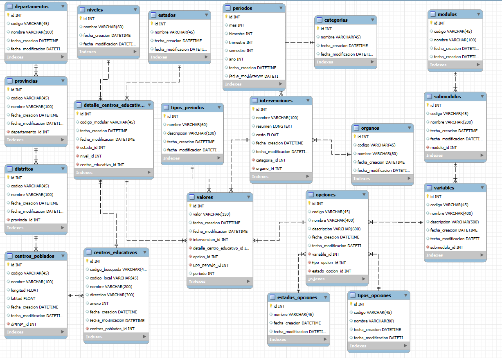

### CHMOD temp folders
```console
sudo chmod -R 775 /home/danielp/myapps/intervenciones/app/tmp  
sudo chown -R www-data:www-data /home/danielp/myapps/intervenciones/app/tmp  
```

### Install Apache , PHP
```console
sudo add-apt-repository ppa:ondrej/php  
sudo apt update  
sudo apt install apache2  
sudo apt install php5.6 libapache2-mod-php5.6 php5.6-mysql  
sudo a2enmod php5.6  
sudo a2enmod rewrite  
```

### Restart Apache
sudo systemctl restart apache2  

### MYSQL USER settings   test
```sql
ALTER USER 'root'@'localhost' IDENTIFIED WITH mysql_native_password BY '1234';  
FLUSH PRIVILEGES;  
```

### MYSQL : change config to old auth
```config
sudo vim /etc/mysql/mysql.conf.d/mysqld.cnf  
[mysqld]  
default_authentication_plugin = mysql_native_password  
```

### Restart Mysql
```console
sudo systemctl restart mysql  
```

###  Create database
```console
mysql -h 127.0.0.1 -u root -p -e "CREATE DATABASE intervenciones;"  
```

###  IMPORT SQL
```console
unzip -p app/migrations/intervenciones.sql.zip | mysql -h 127.0.0.1 -u root -p intervenciones  
```

### Web user login 
admin / 1234  


### SQL SCHEMA


 
